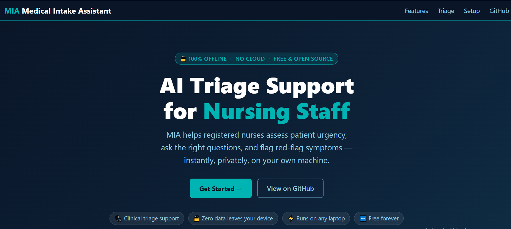

# MIA — Medical Intake Assistant



**🌐 Live Demo:** [drfarooqai.github.io/medical-agent](https://drfarooqai.github.io/medical-agent/)

An offline, AI-assisted triage support tool for registered nursing staff.  
Runs entirely on your local machine using **Ollama + Gradio** — no cloud, no data leaves your device.

> **Clinical Disclaimer:** MIA is a decision-support tool only. All outputs must be verified by a licensed physician before any clinical action. Not approved for unsupervised diagnosis or treatment.

---

## What it does

- Collects patient intake (name, age, gender, chief complaint) before the conversation starts
- Feeds patient context into the AI so every response is personalized
- Rates each case as **🔴 HIGH / 🟡 MODERATE / 🟢 LOW** urgency automatically
- Logs every interaction to `logs/queries.jsonl` for audit and review
- 6 quick-scenario buttons for the most common triage situations

---

## Requirements

| Item | Minimum |
|------|---------|
| OS | Windows 10/11 · macOS 12+ · Ubuntu 20.04+ |
| Python | 3.10 or higher |
| RAM | 8 GB (16 GB recommended) |
| Ollama | Latest version |

---

## Installation — Step by Step

### Step 1 · Install Ollama

| Platform | How to install |
|----------|----------------|
| **Windows** | Download from [ollama.com/download/windows](https://ollama.com/download/windows) and run the installer |
| **macOS** | Download from [ollama.com/download/mac](https://ollama.com/download/mac) and drag to Applications |
| **Linux** | Run in terminal: `curl -fsSL https://ollama.com/install.sh \| sh` |

After installing, verify Ollama is running:

```bash
ollama list
```

You should see a list of models (possibly empty on first run).  
If you see **"connection refused"**, start Ollama manually:
- **Windows / macOS:** Launch the Ollama app from your Start Menu or Applications folder
- **Linux:** Run `ollama serve` in a terminal

---

### Step 2 · Set Up the AI Model

You have two options:

**Option A — Create a model named `mia` (recommended for first-time users)**

```bash
# Pull any capable model (3B is fast, 7B is smarter)
ollama pull llama3.2:3b

# Create a Modelfile
echo "FROM llama3.2:3b" > Modelfile

# Register it as 'mia'
ollama create mia -f Modelfile
```

Verify it worked:
```bash
ollama list
# You should see: mia:latest
```

**Option B — Use any model directly without renaming**

Set the `OLLAMA_MODEL` environment variable before running the app (see Step 5).

---

### Step 3 · Clone the Repository

```bash
git clone https://github.com/DrFarooqAi/medical-agent.git
cd medical-agent
```

---

### Step 4 · Install Python Dependencies

It is recommended to use a virtual environment:

```bash
# Create virtual environment
python -m venv .venv

# Activate it
# Windows:
.venv\Scripts\activate
# macOS / Linux:
source .venv/bin/activate

# Install dependencies
pip install -r requirements.txt
```

Or install globally (simpler):
```bash
pip install -r requirements.txt
```

---

### Step 5 · Run the App

**If you used Option A (model named `mia`):**
```bash
python app.py
```

**If you used Option B (using a different model name):**

```bash
# Windows PowerShell
$env:OLLAMA_MODEL = "llama3.2:3b"
python app.py

# Windows Command Prompt
set OLLAMA_MODEL=llama3.2:3b
python app.py

# macOS / Linux
OLLAMA_MODEL=llama3.2:3b python app.py
```

You should see:
```
Running on local URL:  http://0.0.0.0:7870
```

---

### Step 6 · Open in Your Browser

Navigate to: **http://localhost:7870**

You will see the MIA interface. Fill in the patient intake form, then type or click a quick scenario to begin.

---

## How to Use

1. **Fill the intake form** — Enter patient name, age, gender, and chief complaint
2. **Click a Quick Scenario** or type your own message in the text box
3. **Press Send** (or hit Enter) — MIA responds with a triage assessment and urgency badge
4. **Continue the conversation** — ask follow-up questions about the same patient
5. **Click "Clear / New Patient"** when starting a new case — this resets everything

---

## Configuration

| Environment Variable | Default | Description |
|---------------------|---------|-------------|
| `OLLAMA_MODEL` | `mia:latest` | The Ollama model name to use |

---

## Logs

Every interaction is saved to `logs/queries.jsonl` in JSON-lines format.  
Each line contains one complete session record:

```json
{
  "timestamp": "2026-05-08T14:22:01Z",
  "model": "mia:latest",
  "patient": {
    "name": "Jane Doe",
    "age": "45",
    "gender": "Female",
    "complaint": "chest pain radiating to left arm"
  },
  "triage_level": "HIGH",
  "question": "Patient reports chest pain...",
  "answer": "..."
}
```

To review HIGH urgency interactions:

```bash
# Linux / macOS
grep '"triage_level": "HIGH"' logs/queries.jsonl

# Windows PowerShell
Select-String -Pattern '"triage_level": "HIGH"' logs\queries.jsonl
```

---

## Troubleshooting

| Problem | Fix |
|---------|-----|
| **"Ollama is not running"** appears in chat | Start Ollama (see Step 1), then refresh the page |
| **"model not found"** error | Run `ollama list` to see installed models. Either pull the model or set `OLLAMA_MODEL` to an existing one |
| **Port 7870 already in use** | Edit the last line of `app.py` and change `server_port=7870` to any free port (e.g. `7871`) |
| **Responses are very slow** | This is normal for CPU inference. A 3B model takes 5–30 seconds. Use a smaller model or a machine with a GPU |
| **Blank page or CSS not loading** | Hard-refresh your browser (`Ctrl+Shift+R`) |

---

## Clinical Disclaimer

MIA is intended solely as a decision-support tool to assist trained medical professionals.  
It must not be used as a substitute for clinical judgment, physician consultation, or established triage protocols.  
The authors assume no liability for clinical outcomes resulting from use of this software.
